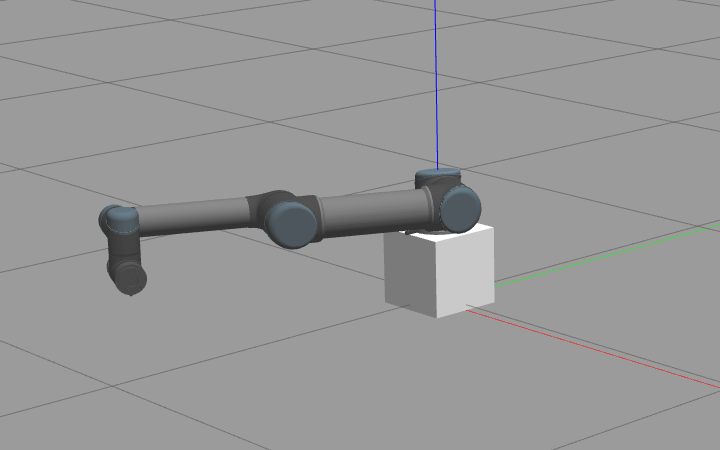

## After launching the GAZEBO, it may hang for a while to download some models. Please, wait 5-10min and kill the simulator once. After then relaunch the simulator again.

# Installation of gym-gazebo2
Create a virtual environment and activate it:
~~~~bash
sudo apt update
sudo apt install python3-venv -y
python3 -m venv ~/.venv/cs477
~~~~

Install new Python dependencies:
~~~~bash
cd "your ROS2 workspace"/src/cs477_IIR/assignment_3
source ~/.venv/cs477/bin/activate
python -m pip install -r requirements.txt
~~~~

Install gym-gazebo2:
~~~~bash
cd "your ROS2 workspace"/src/cs477_IIR/platforms/gym-gazebo2
python -m pip install -e .
~~~~

Then, update dependencies using colcon
~~~~bash
deactivate 2>/dev/null || true
unset PYTHONPATH PYTHONHOME VIRTUAL_ENV

cd ~cs477_WS
source /opt/ros/humble/setup.bash
rosdep update
rosdep install --from-paths src --ignore-src --rosdistro=humble -y
colcon build --symlink-install --packages-skip gazebo_ros
~~~~

# Problem 1
(Terminal 1) openning a new terminal, please run followings
~~~~bash
source ~/.venv/cs477/bin/activate
source /opt/ros/humble/setup.bash
source "your ROS2 workspace"/install/setup.bash
export PYTHONPATH=/usr/lib/python3/dist-packages:$PYTHONPATH
~~~~
run this between each run
~~~~bash
# Stop the ros2 daemon (the real culprit)
ros2 daemon stop 2>/dev/null
pkill -9 -f '_ros2_daemon'
pkill -9 -f 'ros2cli'

# Then everything else
pkill -9 -f gzserver
pkill -9 -f gzclient
pkill -9 -f spawn_entity
pkill -9 -f robot_state_publisher
pkill -9 -f controller_manager
pkill -9 -f ros2_control_node
pkill -9 -f 'ros2 control'
pkill -9 -f 'ros2 launch'

sleep 3   # give sockets time to release

# DDS shared memory
rm -rf /dev/shm/fastrtps_* /dev/shm/sem.fastrtps_* 2>/dev/null
rm -rf /tmp/fastrtps_* 2>/dev/null
~~~~
(Terminal 1) you can test the cartpole gym-gazebo2 by running a random action script:
~~~~bash
python3 src/cs477_IIR/assignment_3/assignment_3/gazebo_cartpole_pid_v0.py -g -r
~~~~
where the environment will be automatically reset when the pole falls over.

You need to complete the gazebo_cartpole_xxx_v0.py code and analyze the performance. 

# Problem 2
(Terminal 1) Launch the UR5 robot with PID controllers:
~~~~bash
ros2 launch ur5_ros2_gazebo ur5_simulation_1dof.launch.py 
~~~~

(Terminal 2) Move the shoulder_pan_joint while setting new gains: 
~~~~bash
ros2 run assignment_3 move_joint
~~~~

(Terminal 3) Then, observe the joint position using rqt_plot
~~~~bash
ros2 run rqt_plot rqt_plot /joint_states/position[0]
~~~~
The graph window may pop up behind your simulator screen or other programs. 

    Screenshot of the problem1 robot posture. 
     

# FAQ
If you cannot see the same posture as the above picture for the problem 1, please install dependencies in the README.md.

After cancelling the gym-gazebo, there may be still running processes. Please, kill those manually by using

~~~~bash
kill $(ps aux | grep 'gz' | awk '{print $2}')
~~~~
or
~~~~bash
kill $(ps aux | grep 'ros' | awk '{print $2}')
~~~~
